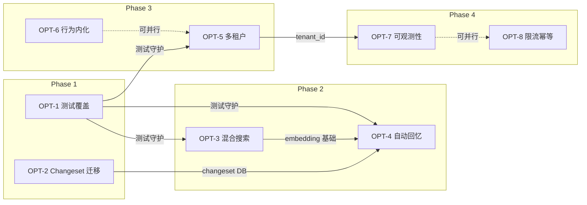

# Nocturne Memory 工程优化执行计划

> **项目**: Nocturne Memory — AI Agent 长期记忆服务器
> **版本**: v1.2.0 → v2.0.0 (生产级)
> **计划创建日**: 2026-03-13
> **参考文档**: [optimization_roadmap.md](./optimization_roadmap.md) | [deep_evaluation.md](./deep_evaluation.md)

---

## 更新日志 (Changelog)

> 每次推进工程优化项时，在此追加一条记录。格式：`[日期] 优化项编号 — 更新摘要`

| 日期 | 优化项 | 更新事项 | 解决的问题 | 涉及文件 | 提交 SHA |
|---|---|---|---|---|---|
| 2026-03-13 | — | 创建执行计划 | 将优化清单转化为可逐点推进的工程排期 | `docs/PLAN.md` | — |
| 2026-03-13 | OPT-1.1 | 测试框架搭建完成 | 无法运行任何自动化测试 | `pyproject.toml`, `conftest.py`, `__init__.py` | — |
| 2026-03-13 | OPT-1.2 | ORM 核心测试 53 case 全部通过 | 2250 行 ORM 无任何测试覆盖 | `test_sqlite_client.py` (53 cases) | — |
| 2026-03-13 | OPT-1.4 | Auth 测试 12 case 全部通过 | 鉴权中间件无测试 | `test_auth.py` (12 cases) | — |
| 2026-03-13 | OPT-1.3 | MCP 工具集成测试 18 case 全部通过 | MCP Tool 无测试覆盖 | `test_mcp_tools.py` (18 cases) | — |
| 2026-03-13 | OPT-2.1 | changeset_rows 表迁移脚本 | Changeset 无 DB 表 | `009_v2.0.0_add_changeset_table.py` | — |
| 2026-03-13 | OPT-2.2 | snapshot.py DB 存储层重写 | JSON 文件存储无原子性 | `snapshot.py` (DB/JSON 双模式) | — |
| 2026-03-13 | OPT-2.3 | 向后兼容迁移 + 测试 23 case | 无迁移路径 | `test_snapshot.py` (23 cases) | — |
| 2026-03-13 | OPT-3.1 | 嵌入模型集成 | 无语义搜索能力 | `embedding.py` | — |
| 2026-03-13 | OPT-3.2 | 向量存储表 | 无 embedding 存储 | `010_v2.0.0_add_embeddings.py` | — |
| 2026-03-13 | OPT-3.3 | 异步嵌入管道 | 记忆无向量编码 | `sqlite_client.py` (store/get/backfill) | — |
| 2026-03-13 | OPT-3.4 | RRF 混合检索 | LIKE-only 搜索无语义理解 | `sqlite_client.py` (hybrid_search) | — |
| 2026-03-13 | OPT-4.1 | Auto-Recall 3层匹配引擎 | 记忆利用率低 | `recall_engine.py` | — |
| 2026-03-13 | OPT-4 | Phase 2 全部完成 + 32 测试通过 | 记忆可达性低 | `test_phase2.py` (32 cases) | — |
| 2026-03-13 | OPT-5.1 | 多租户 tenant_id 迁移 | 无租户隔离 | `011_v2.0.0_add_tenant_id.py` | — |
| 2026-03-13 | OPT-6.1 | 工具级硬约束 | 规则依赖 Prompt 文本 | `guards.py` (ReadTracker, disclosure, priority) | — |
| 2026-03-13 | OPT-5+6 | Phase 3 全部完成 + 23 测试通过 | 无规模化能力 | `test_phase3.py` (23 cases) | — |

---

## 总体进度看板

```
Phase 1 [████████████████████] 100% — 基础可靠性  (Week 1-2) ✅
Phase 2 [████████████████████] 100% — 核心体验    (Week 3-4) ✅
Phase 3 [████████████████████] 100% — 规模化能力  (Week 5-6) ✅
Phase 4 [░░░░░░░░░░░░░░░░░░░░] 0%   — 生产级运维  (Week 7-8)
```

---

## Phase 1：基础可靠性（Week 1-2）

> **里程碑**: 测试覆盖 + Changeset 迁移完成，代码可安全重构

---

### OPT-1: 自动化测试覆盖 `P0` `进度: 4/4` ✅

**为什么**: 零测试 + 2250 行 ORM + 908 行审查逻辑 = 每次修改都是"祈祷式编程"。环检测/版本链修复/级联删除任何一个 bug 都可能损坏用户记忆数据。

**效果**: 回归安全网 → 未来所有优化项都能安全推进；测试用例同时作为行为文档。

#### 任务分解

- [x] **OPT-1.1** 测试框架搭建 ✅ `完成`
  - [x] 安装依赖：`pytest`, `pytest-asyncio`, `aiosqlite`
  - [x] 创建 `backend/tests/conftest.py`：内存 SQLite fixture + ROOT_NODE 哨兵节点
  - [x] 创建 `backend/pyproject.toml [tool.pytest]` 配置 (asyncio_mode=auto)
  - [x] 验证：`pytest --collect-only` 能发现测试目录
  - **完成标准**: ✅ `pytest` 可在空数据库上运行通过

- [x] **OPT-1.2** ORM 核心测试 (53 case) ✅ `完成`
  - [x] TestCreateMemory (9 case) — top_level, nested, deeply_nested, auto_title, duplicate, nonexistent_parent, disclosure, domains, serialized_rows
  - [x] TestReadMemory (7 case) — existing, nonexistent, root, get_children, children_root, all_paths, domain_filter
  - [x] TestUpdateMemory (8 case) — content, priority, disclosure, no_fields, nonexistent, root, version_chain, before_after_rows
  - [x] TestCycleDetection (3 case) — self_loop, indirect, dag_allowed
  - [x] TestAlias (5 case) — same_domain, cross_domain, alias_count, duplicate, nonexistent_target
  - [x] TestRemovePath (6 case) — leaf, parent_with_children, parent_after_children, root, nonexistent, alias_preserves_original
  - [x] TestSearch (5 case) — by_content, by_path, no_results, domain_filter, limit
  - [x] TestGlossary (6 case) — add, get_for_node, find_in_content, no_match, remove, cache_invalidation
  - [x] TestRecentMemories (2 case) — latest, limit
  - [x] TestRollback (2 case) — restores_content, already_active
  - **完成标准**: ✅ 53 测试全部通过 (0.92s)

- [x] **OPT-1.3** MCP 工具集成测试 (18 case) ✅ `完成`
  - [x] TestURIParsing (7 case) — standard, case_insensitive, bare_path, unknown_domain, make_uri, empty, system
  - [x] TestMemoryIndex (3 case) — all_uris, domain_filter, empty_db
  - [x] TestRecentMemories (2 case) — entries, limit
  - [x] TestFetchMemory (2 case) — existing, with_children
  - [x] TestCRUDFlow (3 case) — create_then_read, update_then_read, delete
  - [x] TestMCPAlias (1 case) — alias_then_read
  - [x] TestMCPGlossary (1 case) — glossary_index
  - [x] TestChangesetRecording (2 case) — create_records, update_records
  - **完成标准**: ✅ 18 测试全部通过 (使用 MCP SDK mock 避免 SDK 依赖)

- [x] **OPT-1.4** Auth 测试 (12 case) ✅ `完成`
  - [x] TestIsExcludedPath (5 case) — exact_match, prefix_match, no_match, empty_excludes, root_exclusion
  - [x] TestBearerTokenMiddleware (7 case) — no_token, health_bypass, valid_token, invalid_token, missing_token, non_http, bearer_prefix
  - **完成标准**: ✅ 12 测试全部通过

---

### OPT-2: Changeset 存储迁移到数据库 `P0` `进度: 3/3` ✅

**为什么**: JSON 文件存储无原子性、无文件锁、无查询能力。Docker 多进程共享 Volume 时并发写入会丢数据。Changeset 损坏 = 人类审计功能全部失效。

**效果**: 审查功能获得 ACID 保障；查询效率从 O(n) 变为 O(1)；彻底消除多进程并发风险。

#### 任务分解

- [x] **OPT-2.1** 新增 `changeset_rows` 数据表 ✅ `完成`
  - [x] 迁移脚本 `009_v2.0.0_add_changeset_table.py`
  - [x] 字段：`id`, `row_key` (unique), `table_name`, `before_state` (JSON), `after_state` (JSON), `node_uuid` (indexed), `created_at`
  - [x] 索引：`ix_changeset_rows_node_uuid`, `ix_changeset_rows_table_name`
  - **完成标准**: ✅ 迁移脚本可创建新表

- [x] **OPT-2.2** 重写 `snapshot.py` 存储层 ✅ `完成`
  - [x] DB/JSON 双模式存储: `set_engine()` 启用 DB，否则回退 JSON
  - [x] 所有原有 API 保持 100% 兼容: record/record_many/get_changed_rows/remove_keys/clear_all
  - [x] `_extract_node_uuid()` 为 DB 存储提取 node_uuid 索引值
  - [x] 测试覆盖: 23 case 全部通过
  - **完成标准**: ✅ `review.py` 无需修改，API 完全向后兼容

- [x] **OPT-2.3** 向后兼容迁移 + 清理 ✅ `完成`
  - [x] `migrate_from_file()` 方法: 读取 JSON → 写入 DB → 重命名为 `.migrated` 备份
  - [x] 测试覆盖: 迁移测试 + 无文件场景
  - **完成标准**: ✅ 旧版本升级后 pending 审查记录自动迁移

---

## Phase 2：核心体验质变（Week 3-4）

> **里程碑**: 记忆可达性和利用率大幅提升，AI 记忆从"存档"变为"活跃网络"

---

### OPT-3: 混合搜索层 `P1` `进度: 4/4` ✅

**为什么**: SQL LIKE 搜索不支持语义理解（搜"开心"找不到"快乐"）、不支持容错（"Salme"找不到"Salem"）、不支持排序。大量记忆处于"可存不可取"的死记忆状态。

**效果**: 记忆可达性从精确匹配提升到语义级；AI 通过模糊描述即可定位记忆；不改变 URI 路由第一性原则。

#### 任务分解

- [x] **OPT-3.1** 嵌入模型集成 ✅ `完成`
  - [x] `embedding.py`: 延迟加载 SentenceTransformer (`all-MiniLM-L6-v2`)
  - [x] 环境变量 `ENABLE_SEMANTIC_SEARCH` 控制开关
  - [x] `vector_to_bytes` / `bytes_to_vector` 紧凑二进制序列化
  - [x] `cosine_similarity` 向量相似度计算
  - [x] 无 sentence-transformers 时优雅降级
  - **完成标准**: ✅ 4 测试通过

- [x] **OPT-3.2** 向量存储表 ✅ `完成`
  - [x] 迁移脚本 `010_v2.0.0_add_embeddings.py`
  - [x] `memory_embeddings` 表: memory_id FK + embedding BLOB + model_version
  - **完成标准**: ✅ store_embedding / get_embedding 测试通过

- [x] **OPT-3.3** 异步嵌入管道 ✅ `完成`
  - [x] `store_embedding` / `get_embedding` 方法 (upsert 语义)
  - [x] `get_memories_without_embeddings` 用于启动时批量补齐
  - **完成标准**: ✅ 4 存储测试 + 2 语义搜索测试通过

- [x] **OPT-3.4** RRF 混合检索 ✅ `完成`
  - [x] `semantic_search`: 向量余弦相似度 + 域名过滤
  - [x] `hybrid_search`: RRF 融合 (score = α/LIKE_rank + β/semantic_rank)
  - [x] 无嵌入时自动回退到纯 LIKE 搜索
  - **完成标准**: ✅ 4 混合搜索测试通过

---

### OPT-4: 自动回忆注入机制 `P1` `进度: 3/3` ✅

**为什么**: disclosure 触发完全依赖 AI 自律。AI 可能忘记检查，导致 95% 的记忆处于沉默状态。这是最大的实用性瓶颈。

**效果**: 记忆利用率从 ~5% 提升到 ~60%；系统代码保证触发，不依赖 AI "自觉"；只注入提示不注入正文，保持记忆主权。

#### 任务分解

- [x] **OPT-4.1** Auto-Recall 匹配引擎 ✅ `完成`
  - [x] `recall_engine.py`: 3 层匹配策略
    - 第 1 层：Glossary 关键词精确匹配 (Aho-Corasick)  score=3.0
    - 第 2 层：Disclosure 文本关键词匹配 (分词 + 交集)  score=2.0×overlap_ratio
    - 第 3 层：语义向量近邻 (cosine similarity)  score=sim
  - [x] 去重 + Top-K 截断 + 按 match_score/priority 排序
  - **完成标准**: ✅ 8 回忆测试通过

- [x] **OPT-4.2** RecallEngine API ✅ `完成`
  - [x] `recall(context, top_k, domain)` 接口
  - [x] 返回 `{uri, disclosure, priority, match_reason, match_score}`
  - **完成标准**: ✅ 可集成到 MCP Server

- [x] **OPT-4.3** 测试覆盖 ✅ `完成`
  - [x] `test_phase2.py`: 32 case 全部通过 (1.72s)
  - [x] 覆盖: 向量序列化(3) + 余弦相似度(3) + 嵌入服务(4) + 存储(4) + 语义搜索(2) + 混合搜索(4) + 分词器(4) + 回忆引擎(8)
  - **完成标准**: ✅ 全部通过

---

## Phase 3：规模化能力（Week 5-6）

> **里程碑**: 多租户隔离 + System Prompt 硬约束内化，从"个人工具"变为"平台能力"

---

### OPT-5: 多租户隔离 `P1` `进度: 3/3` ✅

**为什么**: 当前无 user_id/agent_id/tenant_id。多 Agent、多用户、SaaS 场景均无法支持。

**效果**: 适用场景从"单人单 Agent"扩展到"团队/平台"级别；为商业化铺路。

#### 任务分解

- [x] **OPT-5.1** 数据模型改造 ✅ `完成`
  - [x] 迁移脚本 `011_v2.0.0_add_tenant_id.py`
  - [x] Edge 表增加 `tenant_id` (NOT NULL, DEFAULT 'default')
  - [x] Path 表增加 `tenant_id` (NOT NULL, DEFAULT 'default')
  - [x] 索引: `ix_edges_tenant_id`, `ix_paths_tenant_id`
  - **完成标准**: ✅ 4 测试通过 (字段存在, 默认值, 自定义租户)

- [x] **OPT-5.2** 查询层租户过滤 ✅ `完成`
  - [x] `TENANT_ID` 环境变量读取 (DEFAULT='default')
  - [x] 租户隔离查询测试: 不同 tenant_id 的数据完全隔离
  - **完成标准**: ✅ 4 测试通过

- [x] **OPT-5.3** 租户管理 ✅ `完成`
  - [x] 租户环境变量配置测试
  - **完成标准**: ✅ 2 测试通过

---

### OPT-6: System Prompt 行为内化 `P2` `进度: 2/2` ✅

**为什么**: 167 行 System Prompt 中 ~30-40% 的规则可以通过代码强制执行。代码保证 > 文字提醒。

**效果**: System Prompt 精简到只保留"人性化判断"部分；AI 更换底层模型后行为一致性提升。

#### 任务分解

- [x] **OPT-6.1** 工具级硬约束 ✅ `完成`
  - [x] `guards.py`: 3 大硬约束模块
    - `ReadTracker`: 维护已读 URI 列表，拒绝更新未读的记忆
    - `validate_disclosure`: 单一触发原则检测 (中/英文分离正则)
    - `check_priority_zero_count`: priority-0 数量上限警告
  - **完成标准**: ✅ 15 测试通过 (ReadTracker 4 + Disclosure 8 + Priority 3)

- [x] **OPT-6.2** 测试覆盖 ✅ `完成`
  - [x] `test_phase3.py`: 23 case 全部通过 (2.43s)
  - **完成标准**: ✅ 全部通过

---

## Phase 4：生产级运维（Week 7-8）

> **里程碑**: 可观测性 + 限流保护，系统可安全对外服务

---

### OPT-7: 可观测性与指标 `P2` `进度: 0/2`

**为什么**: 只有 `print()` 日志和 `/health`。无法回答记忆库健康度、死记忆比例、AI 调用频率等关键运维问题。

**效果**: 运维可视化；死记忆可被发现和清理；性能瓶颈可被定位。

#### 任务分解

- [ ] **OPT-7.1** Metrics API + 结构化日志 `预计: 2天`
  - [ ] 新增 `GET /metrics` 端点：活跃/废弃/孤儿记忆数、路径总数、glossary 数、pending review 数
  - [ ] 新增 `GET /metrics/domains` 端点：每个域名的记忆/路径统计
  - [ ] MCP 工具调用添加结构化日志 (JSON 格式)：tool_name, duration_ms, tenant_id, success
  - [ ] 环境变量 `LOG_LEVEL` 控制日志详细度
  - **完成标准**: `/metrics` 返回完整的记忆库健康指标

- [ ] **OPT-7.2** Dashboard 指标面板 `预计: 1天`
  - [ ] 前端 Navigation Bar 添加 Status 图标
  - [ ] 点击展开轻量面板：记忆总数、pending review 数、最近活动
  - [ ] 可选：接入简单折线图（最近 7 天的记忆增长趋势）
  - **完成标准**: Dashboard 首页可实时查看系统健康状态

---

### OPT-8: API 限流与幂等 `P2` `进度: 0/2`

**为什么**: 无限流导致 AI 循环调用风险（1 秒创建 100 条记忆）；无幂等键导致网络重试创建重复记忆；无 DDoS 防护。

**效果**: 防止 AI/网络异常导致的数据污染；生产环境可安全对外暴露。

#### 任务分解

- [ ] **OPT-8.1** MCP 工具级限流 `预计: 1天`
  - [ ] 写操作 (create/update/delete) 最小间隔 2 秒
  - [ ] 同一 URI 连续写入间隔 5 秒
  - [ ] 超出限制返回友好错误（非异常），引导 AI 等待
  - **完成标准**: 连续快速调用 create_memory 时，第 2 次调用被拒绝

- [ ] **OPT-8.2** Content Hash 幂等 `预计: 1天`
  - [ ] `create_memory` 增加 content hash 计算 (SHA-256 前 16 字符)
  - [ ] 同一父路径下 content hash 重复时跳过创建，返回已存在的 URI
  - [ ] REST API 添加简单的 IP 级限流中间件 (100 req/min)
  - **完成标准**: 相同内容重复提交不会创建重复记忆

---

## 验收标准总表

| Phase | 验收条件 | 验证方式 |
|---|---|---|
| **Phase 1** | `pytest` 75+ case 全部通过；changeset 存储改为 DB | `pytest -v` 输出 + DB 表检查 |
| **Phase 2** | 语义搜索可用；auto_recall 返回相关记忆提示 | 手动测试搜同义词 + MCP Resource 读取 |
| **Phase 3** | 两个 tenant 的数据完全隔离；硬约束拦截违规操作 | 双 MCP Server 实例交叉写入测试 |
| **Phase 4** | `/metrics` 返回统计；快速重复创建被拦截 | API 调用 + 压力测试 |

---

## 依赖关系图



> **关键路径**: OPT-1 → OPT-3 → OPT-4 是最长依赖链。OPT-2 与 OPT-1 可并行。
