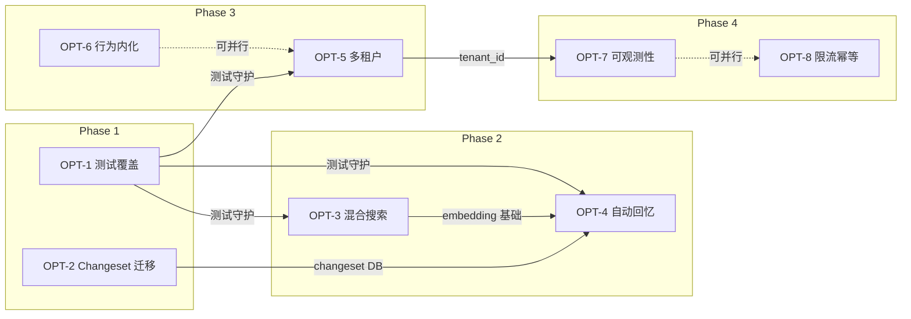

# Nocturne Memory 工程优化执行计划

> **项目**: Nocturne Memory — AI Agent 长期记忆服务器
> **版本**: v1.2.0 → v2.0.0 (生产级)
> **计划创建日**: 2026-03-13
> **参考文档**: [optimization_roadmap.md](./optimization_roadmap.md) | [deep_evaluation.md](./deep_evaluation.md)

---

## 更新日志 (Changelog)

> 每次推进工程优化项时，在此追加一条记录。格式：`[日期] 优化项编号 — 更新摘要`

| 日期 | 优化项 | 更新事项 | 解决的问题 | 涉及文件 | 提交 SHA |
|---|---|---|---|---|---|
| 2026-03-13 | — | 创建执行计划 | 将优化清单转化为可逐点推进的工程排期 | `docs/PLAN.md` | — |
| | | | | | |

---

## 总体进度看板

```
Phase 1 [██░░░░░░░░░░░░░░░░░░] 0%   — 基础可靠性  (Week 1-2)
Phase 2 [░░░░░░░░░░░░░░░░░░░░] 0%   — 核心体验    (Week 3-4)
Phase 3 [░░░░░░░░░░░░░░░░░░░░] 0%   — 规模化能力  (Week 5-6)
Phase 4 [░░░░░░░░░░░░░░░░░░░░] 0%   — 生产级运维  (Week 7-8)
```

---

## Phase 1：基础可靠性（Week 1-2）

> **里程碑**: 测试覆盖 + Changeset 迁移完成，代码可安全重构

---

### OPT-1: 自动化测试覆盖 `P0` `进度: 0/4`

**为什么**: 零测试 + 2250 行 ORM + 908 行审查逻辑 = 每次修改都是"祈祷式编程"。环检测/版本链修复/级联删除任何一个 bug 都可能损坏用户记忆数据。

**效果**: 回归安全网 → 未来所有优化项都能安全推进；测试用例同时作为行为文档。

#### 任务分解

- [ ] **OPT-1.1** 测试框架搭建 `预计: 1天`
  - [ ] 安装依赖：`pytest`, `pytest-asyncio`, `aiosqlite`
  - [ ] 创建 `backend/tests/conftest.py`：内存 SQLite fixture，每个测试完全隔离
  - [ ] 创建 `backend/pytest.ini` 或 `pyproject.toml [tool.pytest]` 配置
  - [ ] 验证：`pytest --collect-only` 能发现测试目录
  - **完成标准**: `pytest` 可在空数据库上运行通过

- [ ] **OPT-1.2** ORM 核心测试 (~40 case) `预计: 3天`
  - [ ] `test_create_memory` — 创建后能通过 URI 读取；Node/Memory/Edge/Path 四表均写入
  - [ ] `test_create_nested` — 多层嵌套创建 `a/b/c`，路径级联正确
  - [ ] `test_update_patch_mode` — old_string→new_string 精确替换；旧版本 deprecated
  - [ ] `test_update_append_mode` — 追加内容到 Memory 末尾
  - [ ] `test_version_chain` — 连续 update 3 次后，migrated_to 链条完整
  - [ ] `test_version_chain_delete` — 删除中间版本后，链条自动跳接修复
  - [ ] `test_cycle_detection_self_loop` — A→A 被拒绝
  - [ ] `test_cycle_detection_indirect` — A→B→C，添加 C→A 被拒绝
  - [ ] `test_cycle_detection_allows_dag` — 非循环的 DAG 边被允许
  - [ ] `test_cascade_delete_path` — 删除父路径，子路径级联删除
  - [ ] `test_cascade_delete_node` — 删除节点，4 张表全部清理
  - [ ] `test_alias_same_domain` — 同域名创建别名
  - [ ] `test_alias_cross_domain` — 跨域名创建别名，两个 URI 指向同一 Memory
  - [ ] `test_delete_alias_preserves_original` — 删除别名不影响原始路径
  - [ ] `test_orphan_deprecation` — 所有路径删除后，Memory 自动标记 deprecated
  - [ ] `test_glossary_add_keyword` — 绑定关键词到节点
  - [ ] `test_glossary_find_in_content` — Aho-Corasick 在正文中找到目标关键词
  - [ ] `test_glossary_cache_invalidation` — 添加新关键词后缓存指纹更新
  - [ ] `test_search_like` — SQL LIKE 子字符串匹配
  - [ ] `test_search_with_domain_filter` — 域名过滤
  - **完成标准**: 40+ 测试全部通过，覆盖 `sqlite_client.py` 所有 public 方法

- [ ] **OPT-1.3** MCP 工具集成测试 (~20 case) `预计: 2天`
  - [ ] `test_read_system_boot` — `system://boot` 返回核心记忆 + 最近修改
  - [ ] `test_read_system_index` — `system://index` 返回全量路径列表
  - [ ] `test_read_system_recent` — `system://recent` 返回按时间排序的记忆
  - [ ] `test_read_system_glossary` — `system://glossary` 返回豆辞典
  - [ ] `test_read_normal_uri` — 读取常规 URI，含 children 和 glossary scan
  - [ ] `test_create_then_read` — 创建后立即读取，内容一致
  - [ ] `test_update_no_full_replace` — 不提供 old_string/new_string 时拒绝
  - [ ] `test_delete_cascades_children` — 删除父节点后子节点变为 orphan
  - [ ] `test_add_alias_creates_entry` — add_alias 后新 URI 可读取
  - [ ] `test_manage_triggers_add_remove` — 添加/移除 glossary 关键词
  - **完成标准**: 20+ 测试全部通过，覆盖 `mcp_server.py` 全部 7 个 MCP Tool

- [ ] **OPT-1.4** 审查与回滚测试 (~15 case) `预计: 2天`
  - [ ] `test_changeset_records_create` — create 操作记录 before=null, after=state
  - [ ] `test_changeset_records_update` — update 操作记录 before=旧值, after=新值
  - [ ] `test_changeset_overwrite_keeps_before` — 多次修改只更新 after，before 冻结
  - [ ] `test_gc_noop_create_delete` — 创建后又删除，changeset 自动清除
  - [ ] `test_review_groups` — GET /review/groups 返回按 node_uuid 分组的列表
  - [ ] `test_review_diff` — GET /review/groups/{uuid}/diff 返回正确的 before/after diff
  - [ ] `test_approve_removes_changeset` — approve 后 changeset 记录被清除
  - [ ] `test_rollback_restores_memory` — rollback 后 Memory 内容恢复到 before 状态
  - [ ] `test_rollback_new_node` — rollback 一个新创建的节点 → 整个节点被删除
  - [ ] `test_auth_with_token` — 带正确 Token 的请求通过
  - [ ] `test_auth_without_token` — 无 Token 的请求被拒绝
  - [ ] `test_auth_health_bypass` — /health 端点不需要 Token
  - **完成标准**: 15+ 测试全部通过；CI pipeline 可配置 `pytest` 运行

---

### OPT-2: Changeset 存储迁移到数据库 `P0` `进度: 0/3`

**为什么**: JSON 文件存储无原子性、无文件锁、无查询能力。Docker 多进程共享 Volume 时并发写入会丢数据。Changeset 损坏 = 人类审计功能全部失效。

**效果**: 审查功能获得 ACID 保障；查询效率从 O(n) 变为 O(1)；彻底消除多进程并发风险。

#### 任务分解

- [ ] **OPT-2.1** 新增 `changeset_rows` 数据表 `预计: 1天`
  - [ ] 在 `sqlite_client.py` 中定义 `ChangesetRow` ORM Model
  - [ ] 字段：`id`, `row_key` (unique), `table_name`, `before_state` (JSON), `after_state` (JSON), `node_uuid` (indexed), `created_at`
  - [ ] 创建迁移脚本 `009_add_changeset_table.py`
  - **完成标准**: `init_db()` 后新表存在且可写入

- [ ] **OPT-2.2** 重写 `snapshot.py` 存储层 `预计: 2天`
  - [ ] `record()` → `INSERT ... ON CONFLICT(row_key) DO UPDATE SET after_state=...`
  - [ ] `record_many()` → 批量 upsert
  - [ ] `get_changed_rows()` → `SELECT WHERE before_state IS DISTINCT FROM after_state`
  - [ ] `remove_keys()` → `DELETE WHERE row_key IN (...)`
  - [ ] `clear_all()` → `DELETE FROM changeset_rows`
  - [ ] `get_change_count()` → `SELECT COUNT(*)`
  - [ ] Net-zero GC → `DELETE WHERE before_state IS NULL AND after_state IS NULL`
  - **完成标准**: 所有 `snapshot.py` 原有 API 保持不变；`review.py` 无需修改

- [ ] **OPT-2.3** 向后兼容迁移 + 清理 `预计: 0.5天`
  - [ ] `init_db()` 中检测旧 `changeset.json` 是否存在
  - [ ] 存在则一次性导入到 `changeset_rows` 表
  - [ ] 导入成功后重命名为 `changeset.json.migrated` (备份而非删除)
  - [ ] 删除 Docker Compose 中的 `snapshots_data` Volume 依赖
  - **完成标准**: 从旧版本升级后，pending 审查记录完整保留

---

## Phase 2：核心体验质变（Week 3-4）

> **里程碑**: 记忆可达性和利用率大幅提升，AI 记忆从"存档"变为"活跃网络"

---

### OPT-3: 混合搜索层 `P1` `进度: 0/4`

**为什么**: SQL LIKE 搜索不支持语义理解（搜"开心"找不到"快乐"）、不支持容错（"Salme"找不到"Salem"）、不支持排序。大量记忆处于"可存不可取"的死记忆状态。

**效果**: 记忆可达性从精确匹配提升到语义级；AI 通过模糊描述即可定位记忆；不改变 URI 路由第一性原则。

#### 任务分解

- [ ] **OPT-3.1** 嵌入模型集成 `预计: 2天`
  - [ ] 选型：`sentence-transformers/all-MiniLM-L6-v2` (轻量, 22MB, 多语言)
  - [ ] 创建 `backend/embedding.py`：封装模型加载 + encode 接口
  - [ ] 支持延迟加载（首次搜索时才加载模型，避免启动变慢）
  - [ ] 环境变量 `ENABLE_SEMANTIC_SEARCH=true/false` 控制开关
  - **完成标准**: `embed("hello world")` 返回 384 维向量

- [ ] **OPT-3.2** 向量存储表 `预计: 1天`
  - [ ] SQLite: 新增 `memory_embeddings` 表 (memory_id, embedding BLOB, model_version)
  - [ ] PostgreSQL: 使用 pgvector 扩展 + `VECTOR(384)` 类型
  - [ ] 迁移脚本 `010_add_embeddings.py`
  - **完成标准**: 向量可存入、可按 memory_id 查询

- [ ] **OPT-3.3** 异步嵌入管道 `预计: 1天`
  - [ ] `create_memory` / `update_memory` 操作完成后，异步生成嵌入并写入
  - [ ] 启动时扫描 missing embedding 的 Memory，批量补齐
  - [ ] 使用 `asyncio.create_task` 不阻塞主流程
  - **完成标准**: 每条活跃 Memory 都有对应的 embedding 记录

- [ ] **OPT-3.4** RRF 混合检索 `预计: 2天`
  - [ ] 改造 `search_memory` MCP Tool：并行执行 LIKE 搜索 + 向量搜索
  - [ ] 实现 Reciprocal Rank Fusion 融合两路结果
  - [ ] 排序公式：`score = α * exact_rank + β * semantic_rank` (α=0.4, β=0.6 可配置)
  - [ ] 向量搜索降级：模型未加载时回退到纯 LIKE
  - [ ] 测试：确认语义搜索能找到"同义词"记忆
  - **完成标准**: `search_memory("快乐")` 能返回包含"开心"的记忆

---

### OPT-4: 自动回忆注入机制 `P1` `进度: 0/3`

**为什么**: disclosure 触发完全依赖 AI 自律。AI 可能忘记检查，导致 95% 的记忆处于沉默状态。这是最大的实用性瓶颈。

**效果**: 记忆利用率从 ~5% 提升到 ~60%；系统代码保证触发，不依赖 AI "自觉"；只注入提示不注入正文，保持记忆主权。

#### 任务分解

- [ ] **OPT-4.1** Auto-Recall 匹配引擎 `预计: 2天`
  - [ ] 创建 `backend/recall_engine.py`
  - [ ] 三层匹配策略：
    - 第 1 层：Glossary 关键词精确匹配（复用 Aho-Corasick）
    - 第 2 层：Disclosure 文本关键词匹配（分词 + 交集）
    - 第 3 层：语义向量近邻（复用 OPT-3 的嵌入）
  - [ ] 去重 + Top-5 截断 + 按 priority 排序
  - **完成标准**: 输入文本 → 输出最相关的 5 条 `(uri, disclosure, match_reason)` 元组

- [ ] **OPT-4.2** MCP Resource 接口 `预计: 2天`
  - [ ] 在 `mcp_server.py` 中注册 `auto_recall` Resource
  - [ ] 接受参数：`context` (用户最近消息文本)
  - [ ] 返回格式化的轻量提示（URI + disclosure + 匹配原因）
  - [ ] 新增 `recall_memory` MCP Tool 作为替代接入方式
  - **完成标准**: MCP 客户端可读取 `auto_recall` Resource 并获得提示列表

- [ ] **OPT-4.3** 文档与系统提示更新 `预计: 1天`
  - [ ] 更新 `system_prompt.md`：减少"自律检查"指令，改为提示 AI 关注 auto_recall 输出
  - [ ] 更新 `TOOLS.md`：记录 `recall_memory` 工具用法
  - [ ] 更新 README：说明自动回忆功能及配置方式
  - **完成标准**: 文档与实现一致

---

## Phase 3：规模化能力（Week 5-6）

> **里程碑**: 多租户隔离 + System Prompt 硬约束内化，从"个人工具"变为"平台能力"

---

### OPT-5: 多租户隔离 `P1` `进度: 0/3`

**为什么**: 当前无 user_id/agent_id/tenant_id。多 Agent、多用户、SaaS 场景均无法支持。

**效果**: 适用场景从"单人单 Agent"扩展到"团队/平台"级别；为商业化铺路。

#### 任务分解

- [ ] **OPT-5.1** 数据模型改造 `预计: 2天`
  - [ ] Path 表增加 `tenant_id` 字段 (NOT NULL, DEFAULT 'default')
  - [ ] Edge 表增加 `tenant_id` 字段
  - [ ] Path 复合主键改为 `(tenant_id, domain, path)`
  - [ ] 迁移脚本 `011_add_tenant_id.py`：现有数据归属 `tenant_id='default'`
  - **完成标准**: 迁移后现有功能完全不受影响

- [ ] **OPT-5.2** 查询层租户过滤 `预计: 2天`
  - [ ] `SQLiteClient` 所有查询方法增加 `tenant_id` 参数
  - [ ] MCP Server 从 `TENANT_ID` 环境变量读取当前租户
  - [ ] FastAPI 从 Bearer Token 或 Header 中解析 tenant_id
  - [ ] 所有 path/edge 查询自动附加 `WHERE tenant_id = :tid`
  - **完成标准**: 不同 tenant_id 的数据完全隔离

- [ ] **OPT-5.3** 租户管理 API `预计: 1天`
  - [ ] `POST /tenants` — 创建租户
  - [ ] `GET /tenants` — 列出所有租户
  - [ ] `GET /tenants/{id}/stats` — 租户级统计
  - [ ] Docker Compose 示例：如何为不同 Agent 配置不同 TENANT_ID
  - **完成标准**: 两个 MCP Server 实例使用不同 TENANT_ID 时数据完全隔离

---

### OPT-6: System Prompt 行为内化 `P2` `进度: 0/2`

**为什么**: 167 行 System Prompt 中 ~30-40% 的规则可以通过代码强制执行。代码保证 > 文字提醒。

**效果**: System Prompt 精简到只保留"人性化判断"部分；AI 更换底层模型后行为一致性提升。

#### 任务分解

- [ ] **OPT-6.1** 工具级硬约束 `预计: 2天`
  - [ ] `update_memory`: 维护"最近 read 的 URI"列表，拒绝 update 未 read 的 URI
  - [ ] `create_memory`: 检查全库 priority=0 的数量，超过 5 条时返回警告
  - [ ] `create_memory`: disclosure 参数改为 required，为空时返回提示
  - [ ] `create_memory`/`update_memory`: disclosure 正则检测"或"/"or"/"以及"，匹配时返回"违反单一触发原则"
  - **完成标准**: 4 条约束全部在代码中强制执行

- [ ] **OPT-6.2** System Prompt 精简 `预计: 1天`
  - [ ] 删除已被代码内化的规则段落
  - [ ] 保留：何时创建/更新/删除（需要判断力）、提炼方法论、priority 排序理念
  - [ ] 新增：说明哪些规则已由系统自动执行
  - **完成标准**: System Prompt 从 167 行缩减到 ~100 行；功能覆盖不变

---

## Phase 4：生产级运维（Week 7-8）

> **里程碑**: 可观测性 + 限流保护，系统可安全对外服务

---

### OPT-7: 可观测性与指标 `P2` `进度: 0/2`

**为什么**: 只有 `print()` 日志和 `/health`。无法回答记忆库健康度、死记忆比例、AI 调用频率等关键运维问题。

**效果**: 运维可视化；死记忆可被发现和清理；性能瓶颈可被定位。

#### 任务分解

- [ ] **OPT-7.1** Metrics API + 结构化日志 `预计: 2天`
  - [ ] 新增 `GET /metrics` 端点：活跃/废弃/孤儿记忆数、路径总数、glossary 数、pending review 数
  - [ ] 新增 `GET /metrics/domains` 端点：每个域名的记忆/路径统计
  - [ ] MCP 工具调用添加结构化日志 (JSON 格式)：tool_name, duration_ms, tenant_id, success
  - [ ] 环境变量 `LOG_LEVEL` 控制日志详细度
  - **完成标准**: `/metrics` 返回完整的记忆库健康指标

- [ ] **OPT-7.2** Dashboard 指标面板 `预计: 1天`
  - [ ] 前端 Navigation Bar 添加 Status 图标
  - [ ] 点击展开轻量面板：记忆总数、pending review 数、最近活动
  - [ ] 可选：接入简单折线图（最近 7 天的记忆增长趋势）
  - **完成标准**: Dashboard 首页可实时查看系统健康状态

---

### OPT-8: API 限流与幂等 `P2` `进度: 0/2`

**为什么**: 无限流导致 AI 循环调用风险（1 秒创建 100 条记忆）；无幂等键导致网络重试创建重复记忆；无 DDoS 防护。

**效果**: 防止 AI/网络异常导致的数据污染；生产环境可安全对外暴露。

#### 任务分解

- [ ] **OPT-8.1** MCP 工具级限流 `预计: 1天`
  - [ ] 写操作 (create/update/delete) 最小间隔 2 秒
  - [ ] 同一 URI 连续写入间隔 5 秒
  - [ ] 超出限制返回友好错误（非异常），引导 AI 等待
  - **完成标准**: 连续快速调用 create_memory 时，第 2 次调用被拒绝

- [ ] **OPT-8.2** Content Hash 幂等 `预计: 1天`
  - [ ] `create_memory` 增加 content hash 计算 (SHA-256 前 16 字符)
  - [ ] 同一父路径下 content hash 重复时跳过创建，返回已存在的 URI
  - [ ] REST API 添加简单的 IP 级限流中间件 (100 req/min)
  - **完成标准**: 相同内容重复提交不会创建重复记忆

---

## 验收标准总表

| Phase | 验收条件 | 验证方式 |
|---|---|---|
| **Phase 1** | `pytest` 75+ case 全部通过；changeset 存储改为 DB | `pytest -v` 输出 + DB 表检查 |
| **Phase 2** | 语义搜索可用；auto_recall 返回相关记忆提示 | 手动测试搜同义词 + MCP Resource 读取 |
| **Phase 3** | 两个 tenant 的数据完全隔离；硬约束拦截违规操作 | 双 MCP Server 实例交叉写入测试 |
| **Phase 4** | `/metrics` 返回统计；快速重复创建被拦截 | API 调用 + 压力测试 |

---

## 依赖关系图



> **关键路径**: OPT-1 → OPT-3 → OPT-4 是最长依赖链。OPT-2 与 OPT-1 可并行。
