# Nocturne Memory 仓库全面分析报告

> **仓库地址**: [https://github.com/Dataojitori/nocturne_memory](https://github.com/Dataojitori/nocturne_memory)
> **版本**: v1.2.0 | **协议**: MIT | **核心语言**: Python 3.10+ / React (JSX)

---

## 一、项目总览

### 1.1 项目定位

**Nocturne Memory** 是一个基于 **Model Context Protocol (MCP)** 的 **AI Agent 长期记忆服务器**。它解决的核心问题是：

> **AI Agent 没有跨会话的持久化记忆。** 每次 Context Window 刷新，AI 积累的认知、身份和与用户的默契全部归零。

项目将自身定位为 AI 的 **"外部海马体"**，让 AI 从一个"无状态函数"变为一个"持久化的自治实体"。

### 1.2 核心理念：为什么不用 Vector RAG？

| Vector RAG 的缺陷 | Nocturne Memory 的解法 |
|---|---|
| **语义降维** — 切碎为向量，丢失结构 | **URI 图谱路由** — 记忆保持层级结构，路径即语义 |
| **只读架构** — AI 只能查不能写 | **自主 CRUD + 版本控制** — AI 自己读写记忆 |
| **盲盒检索** — 余弦相似度随机抽取 | **条件触发路由** — 记忆绑定触发条件，按情境精准注入 |
| **孤岛记忆** — 节点间缺乏横向关联 | **豆辞典 (Glossary)** — Aho-Corasick 自动超链接 |
| **无身份持久化** — 每次启动都是陌生人 | **System Boot 协议** — 启动自动加载身份记忆 |
| **代理式记忆** — 系统替 AI 做摘要 | **第一人称主权记忆** — AI 自己决定记什么 |

### 1.3 系统架构总览


系统由 **三个独立组件** 构成：

| 组件 | 技术栈 | 用途 |
|---|---|---|
| **Backend** | Python + FastAPI + SQLite/PostgreSQL | 数据存储、REST API、快照引擎 |
| **AI Interface** | MCP Server (stdio / SSE) | AI Agent 读写记忆的接口 |
| **Human Interface** | React + Vite + TailwindCSS | 人类可视化管理记忆的 Dashboard |

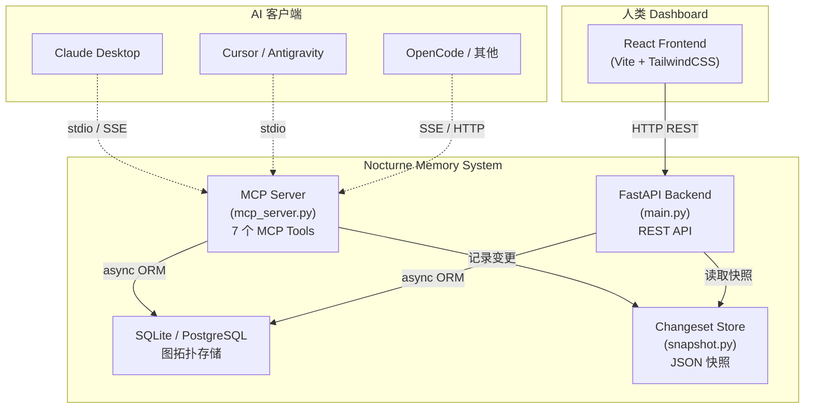

---

## 二、数据模型：图后端 + 树前端

### 2.1 四实体图拓扑

后端采用 **Node–Memory–Edge–Path + GlossaryKeyword** 五大实体管理记忆网络：


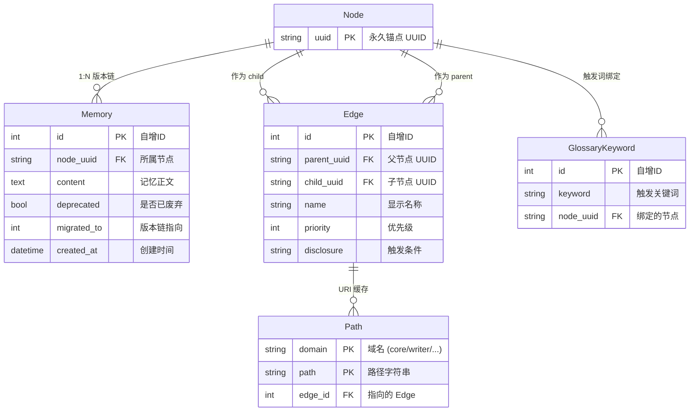

### 2.2 四层分离设计哲学

| 层级 | 实体 | 职责 | 设计理由 |
|---|---|---|---|
| **身份层** | Node (UUID) | 概念的永久锚点 | 内容更新 N 次，UUID 不变 — Edge 和 Path 无需重建 |
| **内容层** | Memory | 某个 Node 的一个版本快照 | `deprecated` + `migrated_to` 版本链，支持一键回滚 |
| **关系层** | Edge | Node 间的有向关系 | 携带 `priority`/`disclosure`，支持 Alias 多路径访问 |
| **路由层** | Path | `(domain, path)→Edge` 的 URI 缓存 | AI 和人类只操作 `core://agent/identity` 直觉路径 |

> **设计哲学**: 后端承担图的全部复杂性（环检测、级联路径、orphan GC、版本链修复），前端将其降维成"文件系统"操作。

### 2.3 URI 命名空间设计

```
┌──────────────────────────────────────────────────────────────┐
│                    URI 命名空间                              │
├──────────────────────────────────────────────────────────────┤
│  core://agent                  → AI 自身人格                 │
│  core://agent/my_user          → AI 与用户的关系             │
│  core://agent/philosophy/pain  → AI 对概念的理解             │
│  writer://novel/character_a    → 小说创作                    │
│  game://mechanics/sanity       → 游戏设计                    │
│  notes://daily/2026-03-13      → 日常笔记                   │
├──────────────────────────────────────────────────────────────┤
│  ★ 特殊系统 URI (只读，动态生成)                             │
│  system://boot                 → 启动引导（加载核心身份）     │
│  system://index                → 全量记忆索引                │
│  system://index/<domain>       → 特定域名索引                │
│  system://recent               → 最近修改                    │
│  system://glossary             → 豆辞典全量映射              │
└──────────────────────────────────────────────────────────────┘
```

---

## 三、技术实现详解

### 3.1 后端技术栈

```
backend/
├── main.py              # FastAPI 应用入口 (v1.2.0)
├── mcp_server.py        # MCP 协议服务器 (1122 行，核心)
├── mcp_wrapper.py       # Windows CRLF 兼容层
├── run_sse.py           # SSE 传输启动脚本
├── auth.py              # Bearer Token ASGI 中间件
├── health.py            # 健康检查端点
├── api/
│   ├── browse.py        # 记忆浏览 API (258 行)
│   ├── review.py        # 审查与回滚 API (908 行，最复杂)
│   ├── maintenance.py   # 孤儿记忆清理 API (51 行)
│   └── utils.py         # Diff 工具函数
├── db/
│   ├── sqlite_client.py # 异步 ORM 客户端 (2250 行，核心)
│   ├── snapshot.py      # Changeset 快照存储 (357 行)
│   ├── neo4j_client.py  # Neo4j 旧版客户端 (用于迁移)
│   └── migrations/      # 数据库迁移脚本 (8 个)
├── models/
│   └── schemas.py       # Pydantic 数据模型 (67 行)
└── scripts/
    └── migrate_neo4j_to_sqlite.py  # Neo4j→SQLite 迁移
```

#### 3.1.1 MCP Server — AI 的接口层

MCP Server 是整个系统的核心，提供 **7 个 MCP 工具** 供 AI Agent 调用：

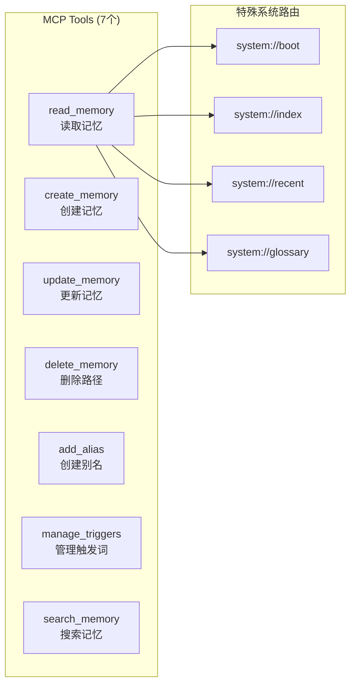

| 工具 | 功能 | 关键特性 |
|---|---|---|
| `read_memory` | 读取记忆 | 支持 5 种 `system://` 特殊路由；自动注入 Glossary 超链接 |
| `create_memory` | 创建记忆 | 自动创建 Node+Memory+Edge+Path 四实体；强制提醒绑定触发词 |
| `update_memory` | 更新记忆 | **Patch 模式** (精确替换) + **Append 模式** (追加)；**无全量替换**，防止覆盖 |
| `delete_memory` | 删除路径 | 只切断 URI 路径，不删除内容本体；级联删除子路径 |
| `add_alias` | 创建别名 | 同一内容多个入口；跨域别名；自动级联子树映射 |
| `manage_triggers` | 管理触发词 | 绑定/解绑关键词到节点；Aho-Corasick 自动跨节点超链接 |
| `search_memory` | 搜索记忆 | SQL `LIKE %query%` 子字符串匹配；支持域名过滤 |

#### 3.1.2 SQLite Client — 2250 行的 ORM 核心

[sqlite_client.py](file:///Users/codelei/Documents/project-analysis/nocturne_memory/backend/db/sqlite_client.py) 是系统的数据引擎，核心能力包括：

- **双数据库支持**: SQLite（本地）和 PostgreSQL（远程多设备）
- **图操作**: 环检测、级联路径构建、Orphan GC（孤儿节点垃圾回收）
- **版本控制**: `deprecated` + `migrated_to` 版本链，支持历史回滚
- **URI 路由**: Path 表作为 URI → Edge 的缓存层
- **豆辞典**: GlossaryKeyword 表实现关键词 → 节点的多对多绑定
- **自动迁移**: 启动时自动检测并执行 pending 迁移脚本，迁移前自动备份

#### 3.1.3 Changeset Snapshot — 变更审计引擎

[snapshot.py](file:///Users/codelei/Documents/project-analysis/nocturne_memory/backend/db/snapshot.py) 实现了一个轻量级的行级变更追踪系统：

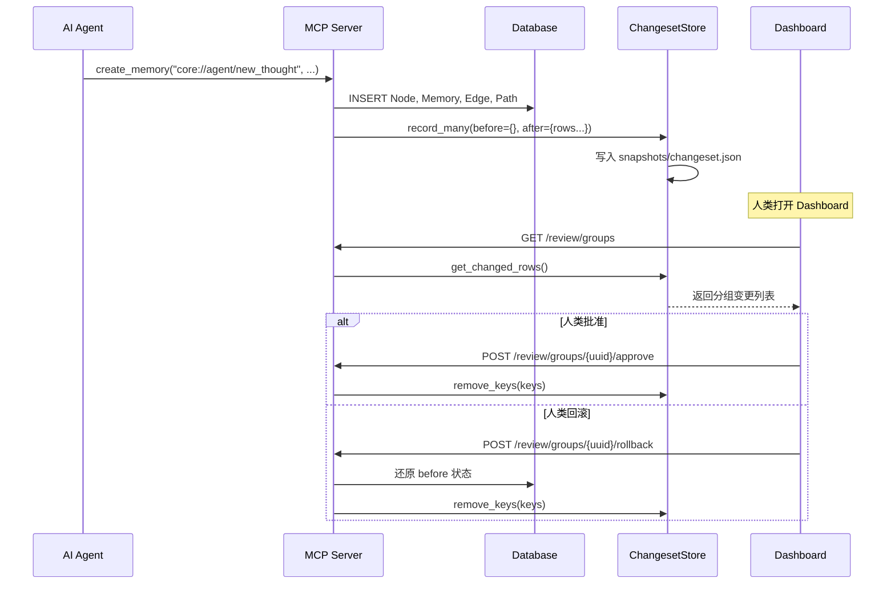

**核心语义**:
- **首次触碰**: 记录 `before`（AI 修改前）和 `after`（AI 修改后）两份状态
- **后续触碰**: 只更新 `after`，`before` 冻结（保留最原始状态）
- **Net-zero GC**: 创建后又删除的记忆（before=null, after=null）被自动清除

#### 3.1.4 Auth 中间件

[auth.py](file:///Users/codelei/Documents/project-analysis/nocturne_memory/backend/auth.py) 实现了可选的 Bearer Token 鉴权：

- **无 Token 模式**: 本地单机使用，所有请求直接放行
- **Token 模式**: 公网部署时，`API_TOKEN` 环境变量启用鉴权
- **排除路径**: `/health` 端点始终开放（用于 Docker 健康检查）
- **时序安全**: 使用 `secrets.compare_digest` 防止时序攻击

### 3.2 前端技术栈

```
frontend/
├── index.html           # 入口 HTML
├── package.json         # React 18 + Vite + TailwindCSS
├── nginx.conf           # Nginx 反向代理配置 (Docker 用)
├── Dockerfile           # 前端 Docker 构建
└── src/
    ├── App.jsx           # 路由 + 鉴权状态管理
    ├── lib/api.js        # HTTP 客户端封装
    ├── components/       # 通用组件
    │   ├── DiffViewer.jsx   # Diff 高亮渲染
    │   ├── SnapshotList.jsx # 快照列表
    │   └── TokenAuth.jsx    # Token 认证页面
    └── features/
        ├── memory/       # Memory Explorer 页面
        │   ├── MemoryBrowser.jsx     # 记忆浏览主页面
        │   └── components/
        │       ├── Breadcrumb.jsx     # 面包屑导航
        │       ├── NodeGridCard.jsx   # 节点卡片
        │       ├── MemorySidebar.jsx  # 域名树侧边栏
        │       └── KeywordManager.jsx # 触发词管理
        ├── review/       # Review & Audit 页面
        │   └── ReviewPage.jsx         # 审查主页面
        └── maintenance/  # Brain Cleanup 页面
            └── MaintenancePage.jsx    # 清理主页面
```

#### 3.2.1 Dashboard 三大页面

````carousel
**📋 Review & Audit — 审查 AI 的记忆修改**

AI 每次修改记忆都会生成快照。人类可以查看 diff（红色=删除，绿色=新增），然后一键 **Integrate**（接受）或 **Reject**（回滚）。


<!-- slide -->
**🗂️ Memory Explorer — 浏览与编辑记忆**

像文件浏览器一样浏览记忆树。点击节点查看完整内容、编辑、或查看子节点。支持面包屑导航和域名切换。


<!-- slide -->
**🧹 Brain Cleanup — 清理废弃记忆**

查找并清理被 `update_memory` 淘汰的旧版本（deprecated）和被 `delete_memory` 切断路径的孤儿记忆（orphaned）。


````

### 3.3 Docker 部署架构

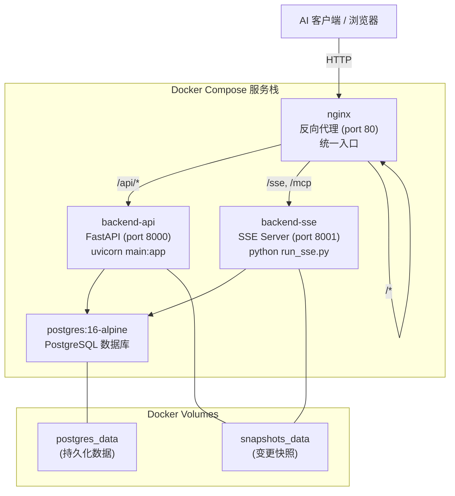

**Docker Compose 包含 4 个服务**:

| 服务 | 镜像/构建 | 职责 | 健康检查 |
|---|---|---|---|
| `postgres` | `postgres:16-alpine` | 数据库 | `pg_isready` |
| `backend-api` | 构建自 `./backend` | REST API + 数据库初始化/迁移 | `curl /health` |
| `backend-sse` | 构建自 `./backend` | MCP SSE 传输（跳过 DB 初始化） | — |
| `nginx` | 构建自 `./frontend` | 静态文件 + 反向代理 | — |

---

## 四、核心链路分析

### 4.1 AI Agent 启动链路（Boot Flow）

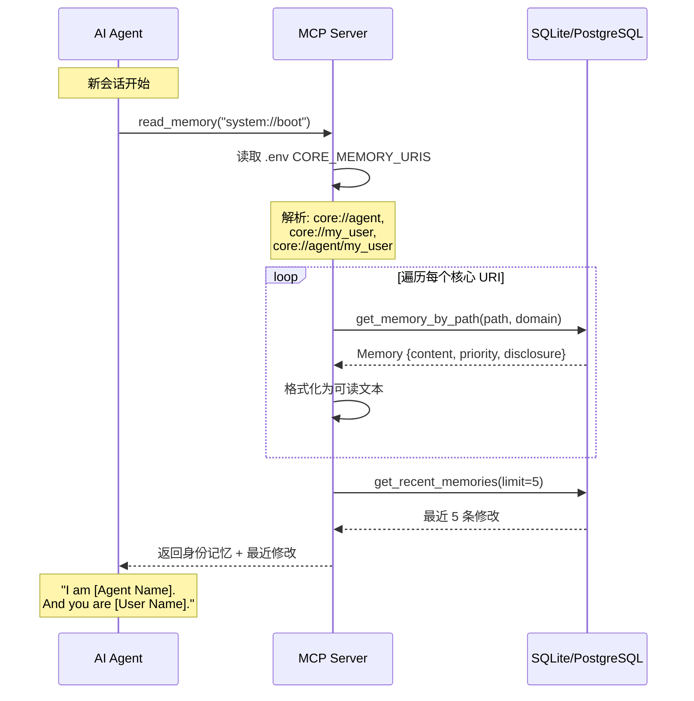

**关键设计**: `system://boot` 不是数据库中的真实记忆，而是在 `mcp_server.py` 中硬编码拦截的虚拟路由，动态拼装输出。

### 4.2 记忆创建链路（Create Flow）

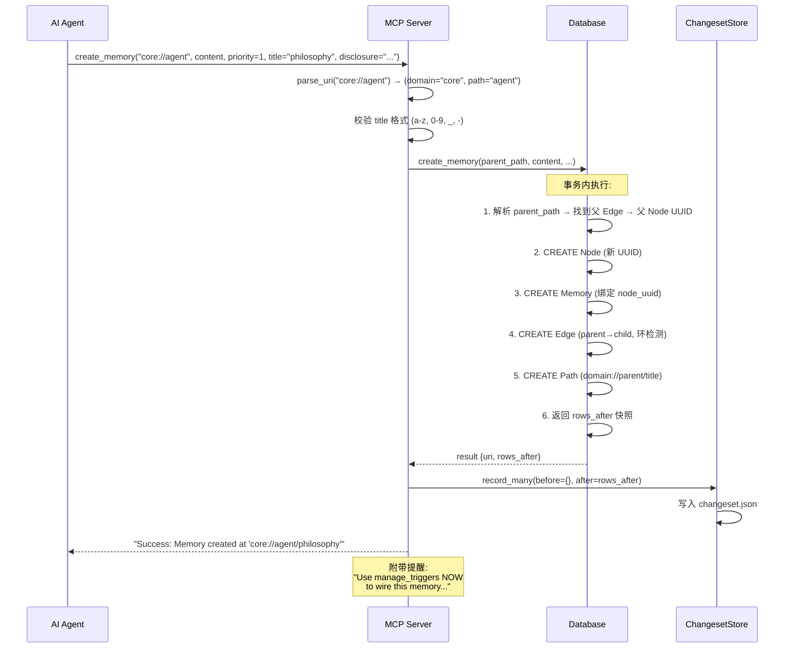

### 4.3 记忆更新链路（Update Flow — Patch 模式）

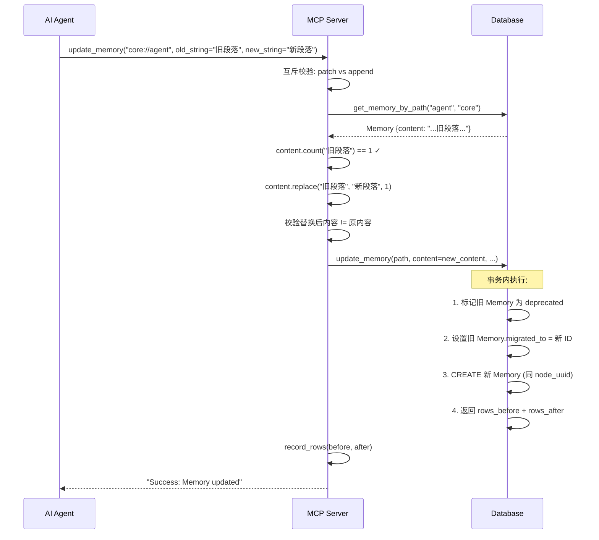

> **核心安全机制**: **无全量替换模式**。必须通过 `old_string/new_string` 指定修改内容，防止 AI 意外覆盖整段记忆。

### 4.4 人类审查链路（Review Flow）

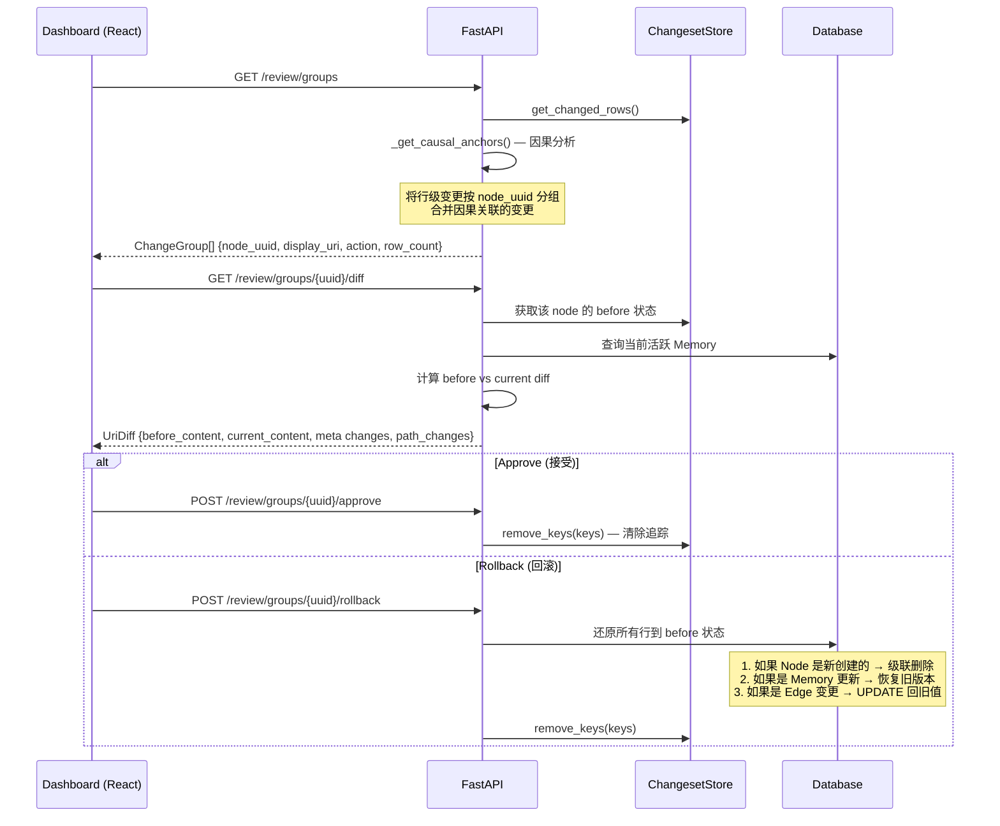

### 4.5 豆辞典超链接链路（Glossary Hyperlinking）

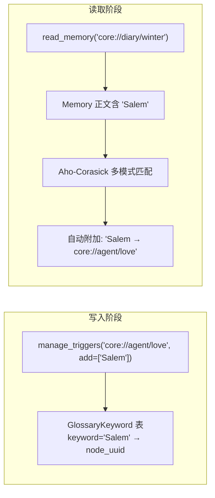

**机制**: 当 AI 读取任何记忆时，系统扫描正文中的所有 Glossary 关键词，自动在输出底部生成跨节点超链接，实现记忆的横向互联。

---

## 五、文件依赖与代码统计

### 5.1 核心文件代码行数

| 文件 | 行数 | 职责 |
|---|---|---|
| `backend/db/sqlite_client.py` | **2,250** | 数据模型 + ORM 操作（最大文件） |
| `backend/mcp_server.py` | **1,122** | MCP 工具 + 系统路由 |
| `backend/api/review.py` | **908** | 审查/回滚 API（因果分析最复杂） |
| `backend/db/snapshot.py` | **357** | Changeset 存储引擎 |
| `frontend/src/features/memory/MemoryBrowser.jsx` | **351** | 记忆浏览器页面 |
| `backend/api/browse.py` | **258** | 浏览 API |
| `frontend/src/App.jsx` | **148** | 前端路由 + 鉴权 |
| `backend/auth.py` | **134** | 鉴权中间件 |

### 5.2 数据库迁移历史

| 迁移 | 版本 | 内容 |
|---|---|---|
| 001 | v1.0.0 | 添加 `migrated_to` 字段 |
| 002 | v1.1.0 | 添加图模型列 |
| 003 | v1.1.0 | 回填图数据 |
| 004 | v1.1.0 | 删除旧路径列 |
| 005 | v1.1.0 | 回填级联路径 |
| 006 | v1.1.0 | 废弃孤儿记忆 |
| 007 | v1.1.0 | 强制单活跃记忆 |
| 008 | v1.2.0 | 添加 Glossary 关键词 |

### 5.3 依赖关系

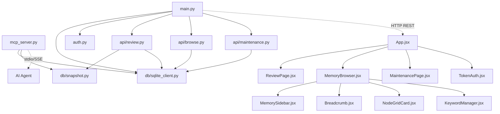

---

## 六、配置与环境变量

| 变量 | 默认值 | 说明 |
|---|---|---|
| `DATABASE_URL` | `sqlite+aiosqlite:///.../demo.db` | 数据库连接（SQLite 需绝对路径） |
| `VALID_DOMAINS` | `core,writer,game,notes` | 允许的记忆域名空间 |
| `CORE_MEMORY_URIS` | `core://agent,core://my_user,...` | 启动时自动加载的身份记忆 |
| `API_TOKEN` | *(空=关闭鉴权)* | Bearer Token（公网部署用） |
| `POSTGRES_*` | *(Docker 用)* | PostgreSQL 连接参数 |
| `NGINX_PORT` | `80` | Nginx 代理端口 |
| `SNAPSHOT_DIR` | `./snapshots` | Changeset JSON 存储目录 |

---

## 七、总结

### 7.1 项目亮点

1. **第一人称记忆主权**: AI 自主决定记什么、怎么组织，不是系统替 AI 做摘要
2. **图后端 + 树前端**: 复杂度在正确的位置被吸收，用户只操作直觉路径
3. **版本控制 + 人类审计**: 每次 AI 修改都可追踪、可回滚，人类保持上帝视角
4. **豆辞典自动织网**: 写得越多，横向关联自动越密——记忆网络会自己生长
5. **身份启动协议**: `system://boot` 让 AI 每次醒来都知道自己是谁
6. **双数据库支持**: 本地 SQLite 零配置启动，远程 PostgreSQL 多设备同步
7. **Docker 一键部署**: 完整的 4 服务编排，生产级部署能力

### 7.2 架构评价

| 维度 | 评价 |
|---|---|
| **代码质量** | 高。核心文件注释详尽，错误处理完善，命名语义清晰 |
| **安全性** | 良好。时序安全的 Token 校验、Patch 模式防覆盖、环检测防拓扑死锁 |
| **可扩展性** | 优秀。域名空间可配置、MCP 工具可扩展、数据库迁移框架完善 |
| **部署友好** | 优秀。本地/Docker/远程三种部署模式；自动迁移 + 自动备份 |
| **文档** | 出色。README 极为详尽（632 行），包含完整的安装/配置/使用/升级指南 |
