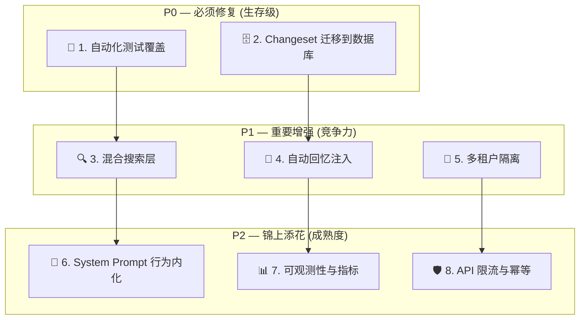
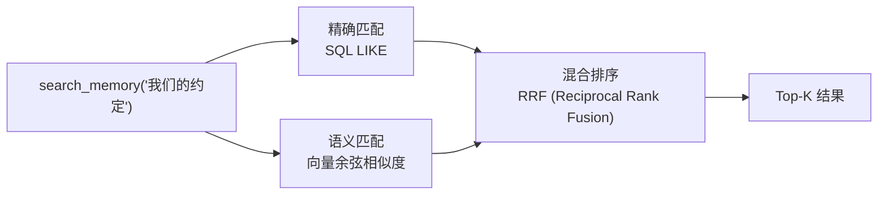
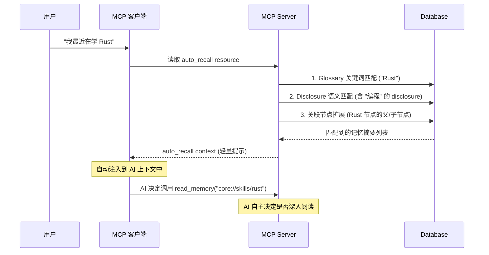
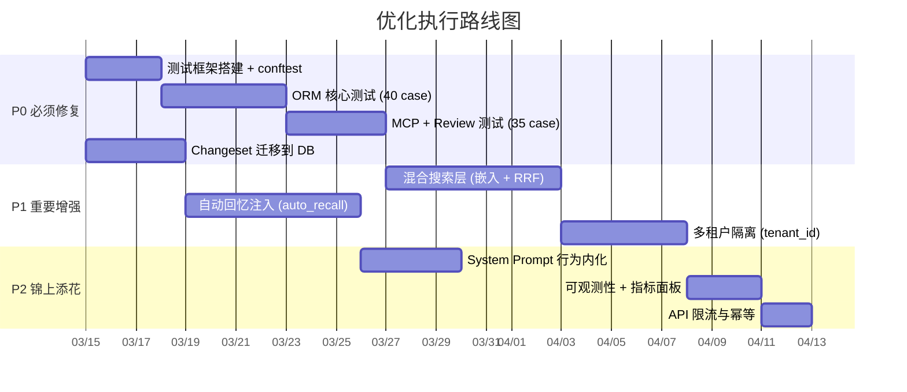

# Nocturne Memory 生产化优化清单

> **目标**: 将 Nocturne Memory 从"用代码写成的论文"升级为"可靠的生产级 AI 记忆基础设施"。
> **原则**: 不改变项目的核心哲学（第一人称主权记忆），而是**用工程手段加固这个哲学的可靠性**。

---

## 优化总览



| 编号 | 优化项 | 优先级 | 工作量 | 影响面 |
|---|---|---|---|---|
| 1 | 自动化测试覆盖 | **P0** | 中 | 所有模块 |
| 2 | Changeset 存储迁移到数据库 | **P0** | 小 | 审查功能可靠性 |
| 3 | 混合搜索层（语义 + 精确） | **P1** | 中 | 记忆可达性 |
| 4 | 自动回忆注入机制 | **P1** | 中 | 核心使用体验 |
| 5 | 多租户隔离 | **P1** | 大 | 规模化能力 |
| 6 | System Prompt 行为内化 | **P2** | 中 | 易用性和可靠性 |
| 7 | 可观测性与指标 | **P2** | 小 | 运维能力 |
| 8 | API 限流与幂等 | **P2** | 小 | 生产稳定性 |

---

## P0 — 必须修复（生存级）

---

### 优化 1：自动化测试覆盖

#### 问题诊断

当前仓库 **零测试文件**。核心 ORM ([sqlite_client.py](file:///Users/codelei/Documents/project-analysis/nocturne_memory/backend/db/sqlite_client.py) — 2250 行) 和审查系统 ([review.py](file:///Users/codelei/Documents/project-analysis/nocturne_memory/backend/api/review.py) — 908 行) 包含大量**易出 bug 的复杂逻辑**：

- **BFS 环检测** (`_would_create_cycle`) — 一个 off-by-one 错误就能允许环的创建，导致无限递归
- **版本链修复** (`_safely_delete_memory`) — predecessor.migrated_to 指针重定向，错误会断裂整条历史链
- **级联删除** (`_cascade_delete_node`) — 跨 4 张表的连锁删除，漏删一行就是数据残留
- **因果锚点分析** (`_get_causal_anchors`) — 200 行 Union-Find + 依赖图分析，逻辑极其密集
- **回滚逻辑** (`rollback_group`) — 需要精确还原数据库到 before 状态

**没有测试意味着**：每次修改这些代码都是"祈祷式编程"——改完祈祷没坏。对于一个管理用户记忆数据的系统，这是不可接受的。

#### 为什么必须优化

| 风险场景 | 后果 |
|---|---|
| 环检测 bug → 允许 A→B→A 的边 | `get_children` 无限递归，进程崩溃 |
| 版本链修复 bug → 指针断裂 | 回滚功能失效，旧版本变成悬空记录 |
| 级联删除 bug → 残留 Edge/Path | 幽灵路径指向不存在的节点，`read_memory` 返回空 |
| 回滚逻辑 bug → 数据覆盖 | 人类点"回滚"反而损坏数据，审计功能反噬 |

#### 预期效果

- **回归安全网**: 每次 PR 自动验证核心路径没有被破坏
- **重构信心**: 未来优化 ORM 层时不再"害怕改"
- **文档价值**: 测试用例本身是最好的 API 行为文档

#### 实施方案

```
backend/
├── tests/
│   ├── conftest.py              # 内存 SQLite 数据库 fixture
│   ├── test_sqlite_client.py    # ORM 层测试 (~40 case)
│   │   ├── test_create_memory
│   │   ├── test_update_with_version_chain
│   │   ├── test_cycle_detection
│   │   ├── test_cascade_delete
│   │   ├── test_alias_cross_domain
│   │   ├── test_orphan_gc
│   │   └── test_glossary_aho_corasick
│   ├── test_mcp_tools.py        # MCP 工具集成测试 (~20 case)
│   │   ├── test_read_memory_system_uris
│   │   ├── test_create_then_read
│   │   ├── test_update_patch_mode
│   │   ├── test_update_no_full_replace
│   │   └── test_delete_cascades_children
│   ├── test_review.py           # 审查/回滚测试 (~15 case)
│   │   ├── test_changeset_record_overwrite
│   │   ├── test_rollback_restores_state
│   │   └── test_gc_noop_creates
│   └── test_auth.py             # 鉴权测试 (~8 case)
```

**关键测试 fixture 设计**：

```python
# conftest.py — 使用内存数据库，每个测试完全隔离
@pytest.fixture
async def db_client():
    client = SQLiteClient("sqlite+aiosqlite:///:memory:")
    await client.init_db()
    yield client
    await client.close()
```

**最核心的 3 个测试用例**：

```python
# 1. 环检测 — 防止拓扑死锁
async def test_cycle_detection_prevents_self_loop(db_client):
    """创建 A→B→C 后，尝试添加 C→A 应被拒绝"""
    await db_client.create_memory(parent_path="", content="A", ...)
    await db_client.create_memory(parent_path="a", content="B", ...)
    await db_client.create_memory(parent_path="a/b", content="C", ...)
    with pytest.raises(ValueError, match="cycle"):
        await db_client.add_path("a", target_path="a/b/c", ...)

# 2. 版本链完整性 — 回滚的基石
async def test_version_chain_survives_delete(db_client):
    """删除中间版本后，predecessor 应跳过被删版本指向 successor"""
    # v1 → v2 → v3, 删除 v2 后应变成 v1 → v3
    ...
    await db_client.permanently_delete_memory(v2_id)
    v1 = await get_memory(v1_id)
    assert v1["migrated_to"] == v3_id

# 3. 级联删除 — 不留残余
async def test_cascade_delete_cleans_all_tables(db_client):
    """删除一个有子节点的路径后，所有子路径/边/节点应被清理"""
    ...
    await db_client.remove_path("parent", domain="core")
    # 验证 4 张表都被清理
    assert await count_paths(db_client, "core", "parent/child") == 0
    assert await count_edges(db_client, child_uuid) == 0
```

---

### 优化 2：Changeset 存储迁移到数据库

#### 问题诊断

当前 [snapshot.py](file:///Users/codelei/Documents/project-analysis/nocturne_memory/backend/db/snapshot.py) 将变更快照存储在 JSON 文件中：

```python
def _save(self, data):
    with open(p, "w", encoding="utf-8") as f:
        json.dump(data, f, ensure_ascii=False, indent=2)  # ← 无原子性、无文件锁
```

**三个工程隐患**：

1. **并发写入数据丢失**: Docker Compose 中 `backend-api` 和 `backend-sse` 共享同一 Volume，两个进程可能同时写入
2. **写入中断数据损坏**: 进程在 `json.dump` 中途被 kill → JSON 文件截断 → 所有 pending 审查记录丢失
3. **无查询能力**: 整个文件 load 进内存 → 线性扫描，随着变更积累越来越慢

#### 为什么必须优化

Changeset 是**人类审计功能的唯一数据源**。如果 changeset 文件损坏，所有未审查的 AI 修改都变成"不可见"——人类失去对 AI 写入行为的监督能力。**这直接违背了项目的核心承诺（"人类保持上帝视角"）。**

#### 预期效果

| 指标 | 当前 | 优化后 |
|---|---|---|
| 并发安全 | ✗ | ✓ 数据库事务保证 |
| 原子性 | ✗ | ✓ 事务回滚保证 |
| 持久性 | 文件系统依赖 | 数据库 ACID |
| 查询效率 | O(n) 全量扫描 | O(1) 索引查询 |

#### 实施方案

**新增一张 `changesets` 表**：

```python
class ChangesetRow(Base):
    __tablename__ = "changeset_rows"

    id = Column(Integer, primary_key=True, autoincrement=True)
    row_key = Column(String(256), unique=True, nullable=False)  # e.g. "nodes:uuid-xxx"
    table_name = Column(String(64), nullable=False)
    before_state = Column(Text, nullable=True)   # JSON
    after_state = Column(Text, nullable=True)    # JSON
    node_uuid = Column(String(36), index=True)   # 预计算的归属节点
    created_at = Column(DateTime, default=datetime.utcnow)
```

**核心改动**：
- `record()` 和 `record_many()` 改用 `INSERT ... ON CONFLICT UPDATE`
- `get_changed_rows()` 改用 `SELECT WHERE before_state != after_state`
- `remove_keys()` 改用 `DELETE WHERE row_key IN (...)`
- `clear_all()` 改用 `TRUNCATE` / `DELETE FROM`

**向后兼容**：启动时检测旧 `changeset.json` 是否存在，如有则一次性导入到新表并删除文件。

---

## P1 — 重要增强（竞争力）

---

### 优化 3：混合搜索层（语义 + 精确）

#### 问题诊断

当前 `search_memory` 只有 SQL `LIKE %query%`：

```python
results = await client.search(query, limit, domain)
# 内部：WHERE content LIKE '%query%' OR path LIKE '%query%'
```

**核心缺陷**：

| 搜索 query | 预期结果 | 实际结果 |
|---|---|---|
| "开心" | 找到包含"快乐""高兴"的记忆 | ✗ 找不到 |
| "Salme" (拼写错误) | 找到 "Salem" | ✗ 找不到 |
| "我们第一次见面" | 找到 first_meeting 记忆 | ✗ 需要精确包含此字符串 |

#### 为什么必须优化

**搜索是 AI 回忆的"最后手段"**。当 AI 不记得某条记忆的 URI 时，`search_memory` 是唯一的救命通道。如果这个通道只能精确匹配，那大量记忆实际上处于"可存不可取"的状态——写了等于没写。

项目在 README 中批评 Vector RAG 的"盲盒检索"，但**完全放弃语义搜索是矫枉过正**。最佳方案是：**URI 路径精确路由为主，语义搜索为辅助发现**。

#### 预期效果

- **记忆可达性大幅提升**: AI 通过模糊描述也能找到相关记忆
- **减少"死记忆"**: 存在但从未被检索到的记忆将减少
- **不破坏现有哲学**: 语义搜索只用于 `search_memory`，不替代 URI 路由

#### 实施方案

**方案核心**: 引入轻量级嵌入模型（本地运行，无外部 API 依赖），为每条记忆生成向量，混合排序。



**技术选型**：

| 方案 | 向量库 | 嵌入模型 | 优点 | 缺点 |
|---|---|---|---|---|
| **A: SQLite + sqlite-vec** | sqlite-vec 扩展 | 本地 sentence-transformers | 零额外依赖 | SQLite 专用 |
| **B: pgvector** | PostgreSQL pgvector | 本地 sentence-transformers | 生产级向量索引 | 仅 PostgreSQL |
| **C: 内存 FAISS** | FAISS in-process | 本地 all-MiniLM-L6-v2 | 极快，零配置 | 重启丢失，需重建 |

**推荐方案 A（SQLite 用户）+ B（PostgreSQL 用户）**：

```python
# 新增 memory_embeddings 表
class MemoryEmbedding(Base):
    __tablename__ = "memory_embeddings"
    memory_id = Column(Integer, ForeignKey("memories.id"), primary_key=True)
    embedding = Column(LargeBinary)  # 序列化的 float32 向量
    model_version = Column(String(64))

# search_memory 改造
async def search(self, query, limit, domain):
    # 1. 精确匹配（现有逻辑）
    exact_results = await self._search_like(query, limit * 2, domain)

    # 2. 语义匹配
    query_vec = self.embed_model.encode(query)
    semantic_results = await self._search_vector(query_vec, limit * 2, domain)

    # 3. RRF 融合排序
    return reciprocal_rank_fusion(exact_results, semantic_results, k=limit)
```

**嵌入时机**: 在 `create_memory` 和 `update_memory` 中异步生成嵌入，不阻塞主流程。

---

### 优化 4：自动回忆注入机制

#### 问题诊断

当前的 disclosure（触发条件）机制**完全依赖 AI 的自律**：

```
当前流程:
用户说 "我最近在学 Rust" → AI 需要自己判断:
  → "有没有某条记忆的 disclosure 包含'编程语言'或'学习'？"
  → AI 可能忘记检查
  → 相关记忆不会被读取
  → 等于没有这些记忆
```

这是整个方案**最大的实用性瓶颈**。一条记忆写得再好、disclosure 设置得再精确，如果 AI 忘了去读，一切归零。

#### 为什么必须优化

**Nocturne Memory 的核心价值主张是"AI 每次醒来都知道自己是谁"**。但如果 AI 只在 `system://boot` 时加载 3-5 条核心记忆，而对话过程中从不主动回忆——那这个系统的 100 条记忆里，95 条都是"沉默的"。

**这不是 System Prompt 能解决的问题**。即使 System Prompt 写得再好，AI 的 context window 有限，它不可能在每轮对话中遍历所有 disclosure 条件。

#### 预期效果

- **记忆利用率从 ~5% 提升到 ~60%**: 相关记忆自动进入 context
- **降低对 System Prompt 的依赖**: 系统代码保证触发，而非依赖 AI 自律
- **保持"第一人称"哲学**: 注入的是提示（"你可能想看看这个"），不是替 AI 做决定

#### 实施方案

**核心思路**: 新增一个 `auto_recall` MCP Resource，在每轮对话开始时由 MCP 客户端自动注入。



**注入内容设计**（轻量提示，不替代 AI 决策）：

```
📍 Auto-Recall: 以下记忆可能与当前对话相关：
- core://skills/rust [★2] — disclosure: "当讨论编程语言时"
- core://projects/wasm_compiler [★3] — 触发词匹配: "Rust"
提示: 使用 read_memory(uri) 查看完整内容。
```

**关键设计原则**：
- 只提示 URI + disclosure + 匹配原因，**不注入记忆正文**（保持记忆主权 — AI 自己决定是否阅读）
- 最多注入 5 条最相关的提示，防止 context 膨胀
- 匹配策略分三层：① Glossary 精确匹配 → ② Disclosure 关键词匹配 → ③ 语义向量近邻

---

### 优化 5：多租户隔离

#### 问题诊断

当前数据模型中 **完全没有** `user_id` / `agent_id` / `tenant_id` 概念。所有数据共享同一个 Node/Memory/Edge/Path 空间。

#### 为什么必须优化

单用户模式限制了项目的适用范围。在以下真实场景中，多租户是刚需：

- **一个用户多个 AI Agent**: 写作助手 和 编程助手 不应共享记忆
- **团队共享部署**: 一台服务器上多个用户各自的 AI
- **SaaS 化**: 如果项目要作为服务提供，租户隔离是法律合规要求

#### 预期效果

- **适用场景从"个人工具"扩展到"团队/平台"级别**
- **为商业化铺路**: SaaS 模式成为可能

#### 实施方案

**最小侵入方案**: 在 Path 和 Edge 表增加 `tenant_id` 字段，Node 和 Memory 保持共享（因为 alias 可能跨租户引用同一概念）。

```python
# 数据隔离策略
class Path(Base):
    tenant_id = Column(String(64), nullable=False, default="default")
    # 复合主键改为 (tenant_id, domain, path)
    __table_args__ = (PrimaryKeyConstraint("tenant_id", "domain", "path"),)

# MCP Server 在启动时从环境变量读取 tenant_id
TENANT_ID = os.getenv("TENANT_ID", "default")
```

**迁移方案**: 现有数据自动归属到 `tenant_id="default"`，零破坏性升级。

---

## P2 — 锦上添花（成熟度）

---

### 优化 6：System Prompt 行为内化

#### 问题诊断

当前有 167 行 System Prompt 指导 AI 的记忆行为，包括"改之前先读""priority 怎么填""disclosure 怎么写"等规则。**这些规则中有一部分是可以在代码中强制执行的**。

#### 为什么优化

将"软约束（AI 可能不遵守）"变为"硬约束（代码保证执行）"，降低 System Prompt 的负担。

#### 实施方案

| System Prompt 中的规则 | 当前 | 可内化为 |
|---|---|---|
| "update 之前必须先 read" | 文字指令 | MCP 工具内置：`update_memory` 自动返回当前内容供 AI 确认，或维护 "最近 read 的 URI" 列表，拒绝 update 未 read 的 URI |
| "priority=0 最多 5 条" | 文字指令 | 数据库约束：`create/update` 时检查全库 priority=0 的数量，超限时返回错误提示 |
| "disclosure 不能为空" | 文字指令 | 工具参数校验：`disclosure` 设为 required 字段 |
| "disclosure 禁止包含 OR" | 文字指令 | 正则校验：检测 "或" / "or" / "以及" 等模式 |

**这意味着 System Prompt 可以缩短 30-40%**，只保留真正需要"人性化判断"的部分（如"什么值得记"、"怎么提炼"）。

---

### 优化 7：可观测性与指标

#### 问题诊断

当前只有 `print()` 日志和 `/health` 端点，无法回答：
- 记忆库一共有多少条活跃记忆？增长趋势如何？
- AI 最常读/写哪些记忆？
- 哪些记忆从未被读取过（"死记忆"）？
- 平均每次对话产生多少次 MCP 调用？

#### 实施方案

```python
# 新增 /metrics 端点
@router.get("/metrics")
async def get_metrics():
    client = get_db_client()
    return {
        "active_memories": await client.count_active(),
        "deprecated_memories": await client.count_deprecated(),
        "orphan_memories": await client.count_orphans(),
        "total_paths": await client.count_paths(),
        "total_glossary_keywords": await client.count_glossary(),
        "pending_review_count": get_changeset_store().get_change_count(),
        "domains": await client.get_domain_stats(),
    }
```

**Dashboard 增强**: 在前端 Navigation Bar 右侧添加一个轻量指标面板，实时显示记忆库健康状态。

---

### 优化 8：API 限流与幂等

#### 问题诊断

当前 API **无任何限流**、MCP 工具调用**无幂等保障**。

| 风险 | 说明 |
|---|---|
| AI 循环调用 | LLM 进入循环，1 秒内连续 create_memory 100 次 |
| 重复创建 | 网络超时重试导致同一条记忆被创建两次 |
| 公网暴露 | Docker 部署后如果 API_TOKEN 泄露，无任何 DDoS 防护 |

#### 实施方案

```python
# 1. MCP 工具级限流
from datetime import datetime, timedelta

_last_write = {}  # uri -> timestamp
MIN_WRITE_INTERVAL = timedelta(seconds=2)

async def create_memory(...):
    if _last_write.get(parent_uri, datetime.min) + MIN_WRITE_INTERVAL > datetime.now():
        return "Error: Too fast. Wait a moment before creating another memory."
    ...

# 2. 幂等键 (content hash)
import hashlib
async def create_memory(parent_uri, content, ...):
    content_hash = hashlib.sha256(content.encode()).hexdigest()[:16]
    existing = await client.find_by_content_hash(parent_path, content_hash)
    if existing:
        return f"Memory already exists at '{existing['uri']}'. Skipping duplicate."
    ...
```

---

## 执行时间线



| 阶段 | 时间 | 里程碑 |
|---|---|---|
| **Phase 1** | Week 1-2 | ✅ 测试覆盖 + Changeset 迁移 → **基础可靠性达标** |
| **Phase 2** | Week 3-4 | ✅ 混合搜索 + 自动回忆 → **核心体验质变** |
| **Phase 3** | Week 5-6 | ✅ 多租户 + 行为内化 → **规模化能力就绪** |
| **Phase 4** | Week 7-8 | ✅ 可观测性 + 限流 → **生产级运维能力** |

---

## 写在最后：从"记忆主权"理想到工程现实

Nocturne Memory 提出了一个**正确但激进**的愿景：AI 应该拥有自己的记忆主权。

这份优化清单的目标不是动摇这个愿景，而是**用工程纪律加固它**：

- **测试覆盖** = 确保记忆数据不会因为 bug 而损坏
- **Changeset 迁移** = 确保人类审计永远可靠
- **混合搜索** = 确保写入的记忆不会变成死数据
- **自动回忆** = 确保 disclosure 不只是装饰，而是真的会触发
- **行为内化** = 确保关键规则不依赖 AI 的"自觉"

> **一个可靠的记忆系统，不是让 AI "自由地记住一切"，而是让 AI "在有安全网的前提下自由地记住一切"。**
> 
> 自由如果没有工程保障，只是口号。
